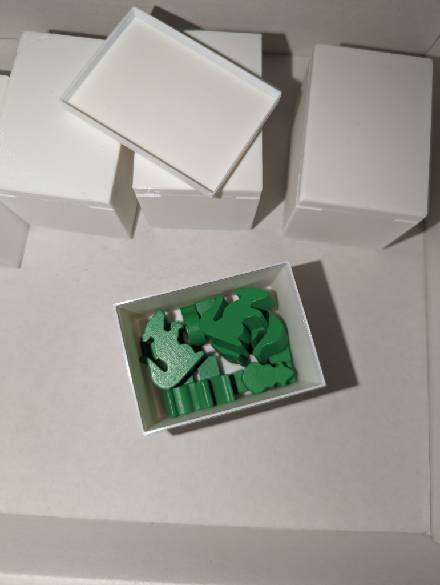

# First Rat BoardGame Insert

This is an insert for the game [First Rat](https://boardgamegeek.com/boardgame/347703/first-rat)

- **player_box_x5**: 5 of this, with lid. 
- **resource_box_top_x1**: one of this with lid
- **resource_box_bottom_x1**: one of this, no lid
- **player_aid_x1**: one of this, no lid
- **ellipse_x1**: One with the lid
- **components_x1**: One, no lid 
- **tokens_x1**: One, with lid

## Caveats
The one image that you can see for the **components_x1** and **tokens_x1** in the pictures below, are slightly different in this version. The **components_x1** is 5 millimeter smaller (on z axis) and the **tokens_x1** is 5 millimeter taller, so all the token of the ame type fit in one compartment. My version (you see in the [token and cards photo](images/token-and-cards.jpg)) can not hold all backpack and comic and bottle caps in their compartment, and two of each is next to the soda. this one here is not like that. 

## Images

    
My print result

    
    
    
    
    
    
    
    

## Links

Created using [The Boardgame Insert Toolkit](https://github.com/dppdppd/The-Boardgame-Insert-Toolkit) 

Tested with [The Mosaic English Edition](https://boardgamegeek.com/boardgameversion/548112/english-edition)